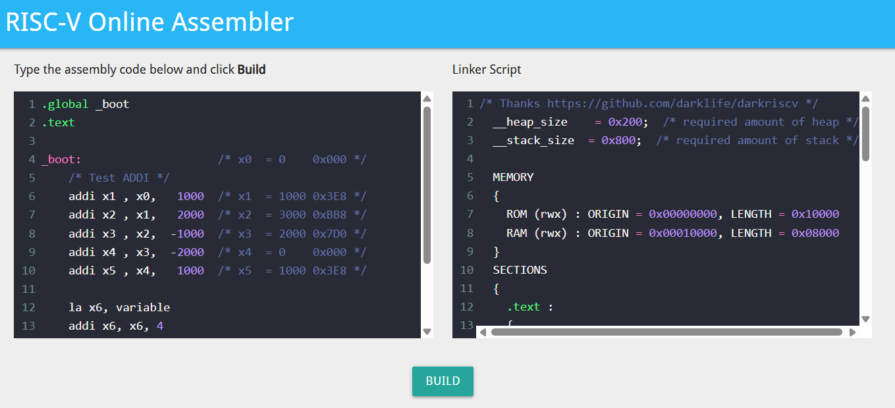

# Programando o Processador

Agora que o processador está completamente montado, o próximo passo é aprender a executar programas nele. Para que o processador consiga executar um programa, ele deve estar no formato correto para se utilizar na simulação.

## Gerando o arquivo com as instruções

Nessa atividade faremos um fluxo simplificado e iremos escrever código diretamente em assembly RISC-V. Para programar o processador a partir de um código em C manualmente são necessários vários passos (configurar o compilador, gerar código de inicialização, alterar o linker script, etc) que estão fora do escopo dessa atividade.

Caso tenha alguma dúvida sobre como escrever as instruções, o livro [Digital Design and Computer Architecture RISC-V Edition](https://www.google.com.br/books/edition/Digital_Design_and_Computer_Architecture/SksiEAAAQBAJ) por Harris & Harris tem um guia nas duas últimas páginas. Os nomes dos registradores (x10 = a0, x5 = t0, etc) aparecem na tabela B.4 da contracapa desse mesmo livro.

O primeiro passo para programar o processador é escrever o código assembly. Para isso usaremos uma ferramenta online capaz de ler o código assembly escrito e transformá-lo em código de máquina, isto é, nas instruções em binário. A ferramenta é o [RISC-V Online Assembler](https://riscvasm.lucasteske.dev/).

O código assembly deve ir na janela da esquerda, como visto na imagem abaixo. Não será necessário interagir com a janela "Linker Script" da direita.



O código em assembly a ser escrito deve ter a seguinte estrutura:

```assembly
.globl _boot
.section .text

_boot:
    # Neste trecho você coloca as instruções que desejar

loop:
    j loop                # Loop infinito para encerrar o programa
```

>IMPORTANTE: não use pseudoinstruções (como por exemplo `li`) em seu código. Se usar, o montador irá gerar instruções incompatíveis com o nosso processador.

Uma vez que o código for escrito, clique no botão `BUILD` para obter a saída. Apenas a janela de saída `Code Hex Dump` será utilizada. Essa janela contém as instruções no formato de máquina, prontas para serem carregadas na memória do processador.


Copie essas instruções e cole-as no arquivo de memória `programa.txt`.

Esse arquivo será lido automaticamente e passado para a memória durante a simulação por meio do parâmetro `MEMORY_FILE` presente no módulo de memória.

## Atividade

Você deve criar um programa em assembly RISC-V que calcule os cinco primeiros números da sequência de Fibonacci. A sequência é dada pelo seguinte algoritmo:

1. O primeiro número é 0 e o segundo número é 1
2. A partir do terceiro número, gere seu valor somando os dois números anteriores (terceiro número: 0+1=1)

Os valores calculados devem ser armazenados na memória em posições específicas, seguindo o mapa:

Posição na Sequência | Número | Endereço de Memória|
|--------------------|--------|--------------------|
| 1°                 | 0      | 128 ou 0x80        |
| 2°                 | 1      | 132 ou 0x84        |
| 3°                 | 1      | 136 ou 0x88        |
| 4°                 | -      | 140 ou 0x8c        |
| 5°                 | -      | 144 ou 0x90        |


Para depurar seu programa, você pode usar um simulador de processador RISC-V como o [venus](https://venus.cs61c.org/).


## Execução da Atividade

Reúna os arquivos do processador das atividades anteriores e adicione os novos componentes com os templates fornecidos. Execute os testes com o script `./run-all.sh`. O resultado será exibido como `OK` em caso de sucesso ou `ERRO` se houver alguma falha.

Se necessário, crie casos de teste adicionais para validar sua implementação.

### Observação importante para a correção

Para que o testbench consiga acessar a memória do seu processador e atribuir uma nota, deve haver um padrão de nomes para a memória.

Primeiro: ao instaciar a memória no seu módulo `core_top.v`, use o nome `mem`.

```verilog
Memory #(
    .MEMORY_FILE(),
    .MEMORY_SIZE()
) mem (
    .clk(),
    .rd_en_i(),
    ...
);
```

Segundo: dentro do módulo `memory.v`, o array que armazena os dados deve ter o nome `memory`.

```verilog
module Memory #(
    parameter MEMORY_FILE = "",
    parameter MEMORY_SIZE = 4096
)(
    input  wire        clk,
    input  wire        rd_en_i,
    ...
);

    reg [31:0] memory [0:(MEMORY_SIZE/4)-1];
```

## Entrega

Realize o *commit* no repositório do **GitHub Classroom**. O sistema de correção automática irá executar os testes e atribuir uma nota com base nos resultados.

> **Dica:**
> Não modifique os arquivos de correção. Para entender melhor o funcionamento dos testes, consulte o script `run.sh` disponível no repositório.